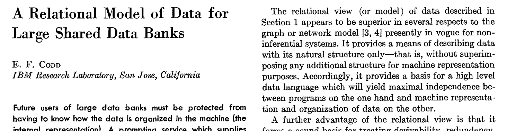
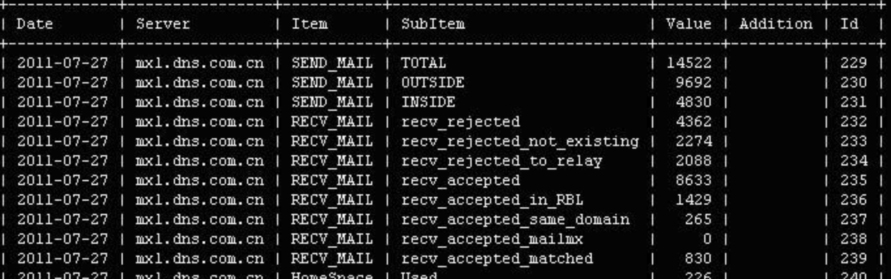
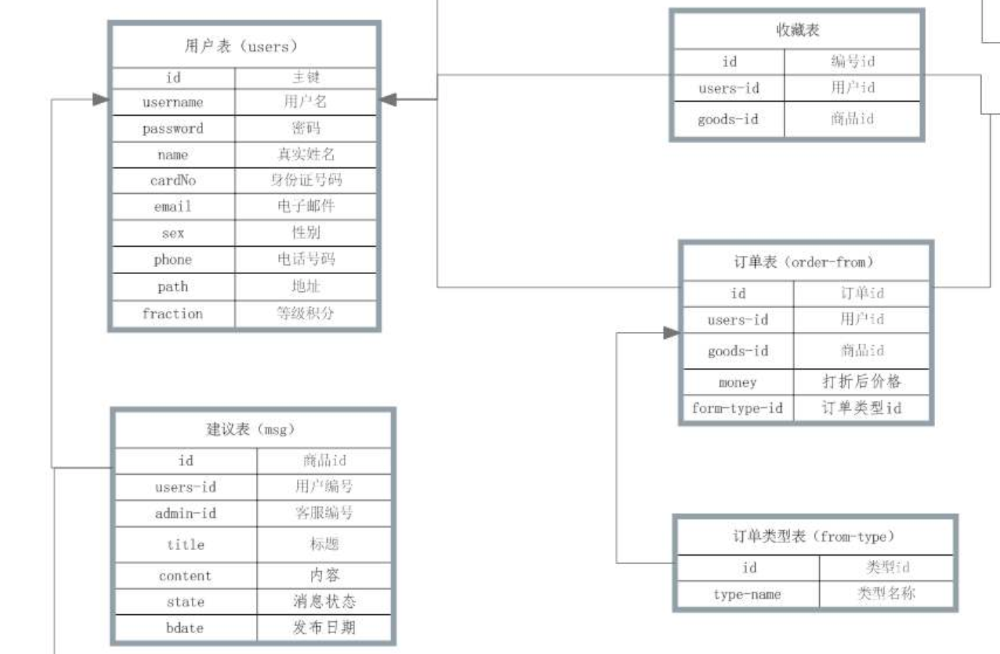
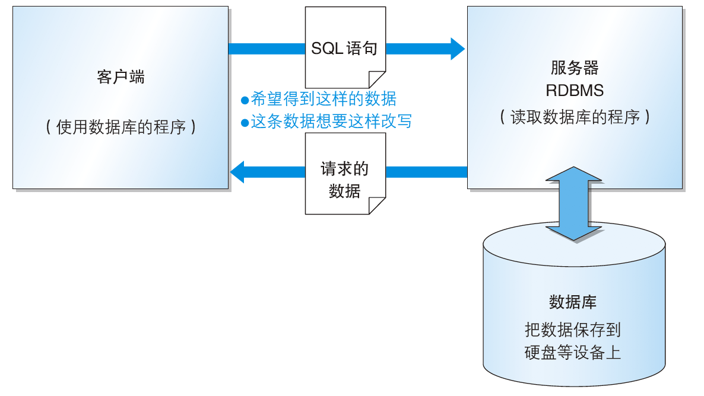
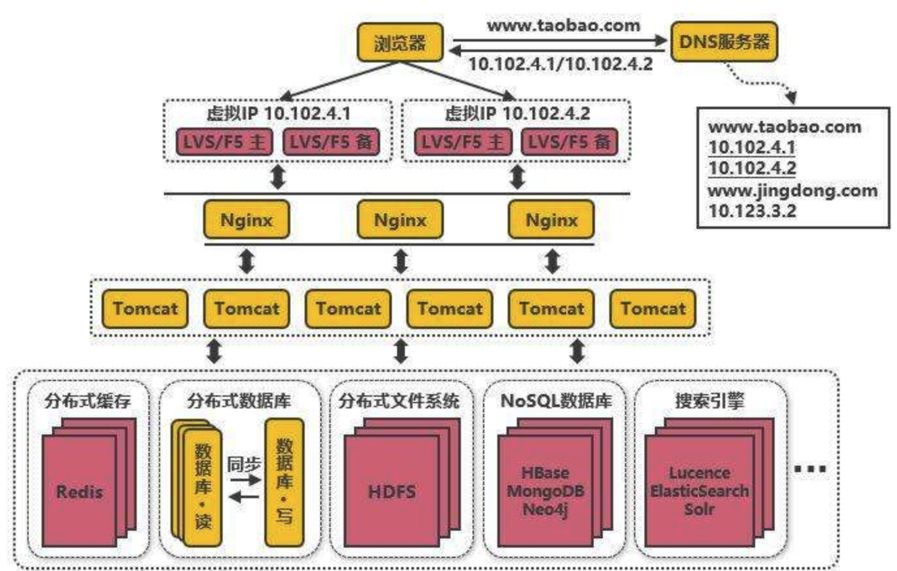
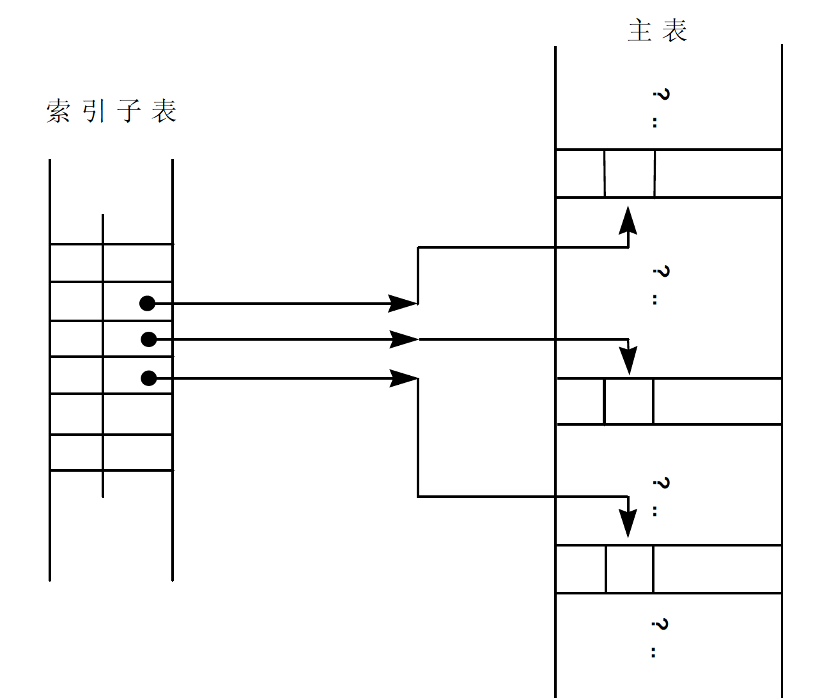

# 关系型数据库

​	关系数据库理论最早是由Codd博士提出的，一个关系的数学描述其实就是一个二维表，这些二维表按照业务运行的规律组合起来，就是关系数据库模型。

​	每个二维表被称为一个实体(Entity)，它可以是人、地点或者某种事物等。表中的每个列被称为属性(Attribute)或者字段(Field)，表中的每一行代表了该实体的一个特定实例，称为记录(Record)。

​	

​	

​	在一个关系数据库模型中，表和表之间是有关联的，这种关联常用所谓的E-R图(Entity-Relationship Diagram)来表示。

​		

​	实体与实体之间的关系有以下三种

- 一对多

  ​	指一个实体中有且只有一条记录与另一个实体中的多条记录对应

- 一对一

  ​	指一个实体中的记录与另一个实体的记录处于一对一的关系。

- 多对多

  ​	指一个实体中的记录与另一个实体的记录是多对多的关系。

## 比较具有代表性的RDBMS 

● Oracle Database：甲骨文公司的RDBMS

● SQL Server ：微软公司的RDBMS

● DB2：IBM 公司的RDBMS

● PostgreSQL：开源的RDBMS

● MySQL ：开源的RDBMS

● Teradata ：teradata公司的基于MPP架构的数据库

## 其他类型的数据库

●面向对象数据库（Object Oriented Database，OODB）

编程语言当中有一种被称为面向对象语言的语言A。把数据以及对数据的操作集合起来以对象为单位进行管理，因此得名。面向对象数据库就是用来保存这些对象的数据库。

●XML数据库（XML Database，XMLDB）

最近几年，XMLB 作为在网络上进行交互的数据的形式逐渐普及起来。XML 数据库可以对XML 形式的大量数据进行高速处理。

●键值存储系统（Key-Value Store，KVS）

这是一种单纯用来保存查询所使用的主键（Key）和值（Value）的组合的数据库。具有编程语言知识的读者可以把它想象成关联数组或者散列（hash）。

●图数据库

使用点和关系来表达数据的数据库，特别擅长路径分析，递归等操作

## 数据库常见架构

使用RDBMS 时，最常见的系统结构就是客户端/ 服务器类型（C/S类型）这种架构

如果在生产系统上，一般会由服务端进行数据库的统一访问，会变成如下架构

​	服务器指的是用来接收其他程序发出的请求，并对该请求进行相应处理的程序（软件），或者是安装了此类程序的设备（计算机）。RDBMS 也是一种服务器，它能够从保存在硬盘上的数据库中读取数据并返回，还可以把数据变更为指定内容。

​	与之相对，向服务器发出请求的程序（软件），或者是安装了该程序的设备（计算机）称为客户端。一般来说，每个数据库都会有自己原生的客户端（一般是命令行方式），以及一些通用客户端（比如jdbc，odbc）

# 键

​	在一个实体中，存在一些能唯一标识该实体中各个记录的属性(或属性组合)，这些属性被称作键(Key)。真正被挑选出来唯一区分各记录的属性称为主键(Primary Key，缩写为PK)，其它未被选中的键称为候选键(Alternate Key，缩写为AK)。

​	一个实体中的哪些属性可以是主键，这与具体的系统和业务规则有关。举例来说，如果一个公司内没有重名的雇员，则将其姓名当作主键也未尝不可。

​	主键属性必须满足以下三个条件：

- 必须能唯一区分各数据记录，即不能有重复值
- 不可以是空值
- 其值很少发生变化

​	由于实体与实体之间存在的关系，引出了另外一个概念：外键(Foreign Key，缩写为FK)。所谓外键，是指一个实体(子表)的一个属性，而这个属性正好是另一个实体(父表)的主键。

​	外键只有透过实体之间的关系才能体现出来。利用主键与外键，可以保证各个实体之间的参照完整性。

# 范式

​	一个设计不好的关系模型可能会产生很多的问题，如过多的冗余、数据不一致、插入与删除异常等。为了能正确地描述和处理这些问题，在关系数据库理论的发展过程当中，逐渐形成并完善了所谓的范式理论，它是数据库逻辑模型设计的基本理论。

**第一范式(The First Normal Form)** 

在一个关系中，如果每个属性的值唯一而不具有多义性，则称它符合第一范式。 

**第二范式**(The Second Normal Form) 

如果一个关系符合第一范式，并且每个非主属性完全依赖于整个主键，而非主键的一部分，则称它符合第二范式。 

**第三范式**(The Third Normal Form) 

如果一个关系符合第二范式，并且每个非主属性不能依赖于其它关系中的属性(因为这样的话，这种属性应该归到其它关系中去)，则称它符合第三范式。 

除了上面介绍的三个范式外，还有更高阶的第四、第五范式。

一个关系模型可以从第一范式到第五范式进行无损分解，这个过程也称为规范化(Normalize)。在数据库的逻辑模型设计中一般采用第三范式就已经足够了。我们可以看到，第三范式的定义基本上是围绕主键与非主属性之间的关系而作出的。

# 逻辑模型和物理模型

​	逻辑模型主要是依据业务规则建立的，为了清晰地反映企业操作模式，我们建立的逻辑模型一般应满足第三范式。

​	而把一个逻辑模型在一个平台上实施时，就变成了物理模型。由于技术上的一些限制，在一些系统中常常不得不对逻辑模型作不规范化处理(De-Normalize)。

​	举例来说，在数据仓库中经常要用到多表的连接操作，而表的连接是比较耗系统资源的。为了避免或减少表的连接操作，一些数据库系统常常不得不把两个或多个表合并起来，这实际上就是一种不规范化处理。

# 索引

​	索引是物理模型中的一个概念，利用索引，可以直接存取表中的某一条记录而不需要搜索整个表。因此，索引提供了一条更快速访问数据记录的途径。当在数据库中针对某个表创建一个索引时，系统将根据此索引建立一个相应的子表。相对原来的表(主表)而言，子表要小得多。它将存储索引的值以及一个与此索引对应的数据记录在主表中的存储位置，这好比一个指向数据记录物理位置的指针

​	

# 数据字典

​	数据字典/目录(Data Dictionary/Directory)简称为DD/D，其中存储了数据库管理系统中所有的系统对象(表、视图与宏)，从中可以得到有关用户、数据库、系统资源的使用情况、数据分布情况、安全规则、访问权限等各种信息。

​	一般DBA会更加关注数据字典，开发人员一般会通过查询数据字典得到一些表的辅助信息。

